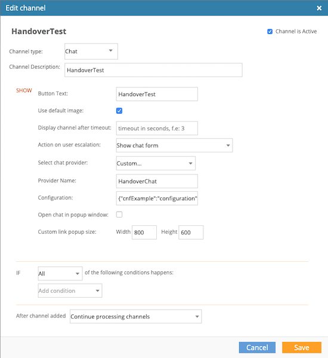

# Handover
**Handing** the control of the chat to a provided custom `ChatHandler` implementation.  
The handover is activated by escalating from a Chat typed channel, which is configured with `custom provider`.

Handover `ChatHandler` implementation should be provided on `ChatController` creation.
```kotlin
val chatController = ChatController.Builder(context)
                                .chatHandoverHandler(myHandoverHandler)
                                ...
                                .build(account,...)
```


### How to implement
Extend `HandoverHandler`

#### Points of notice

- Chat elements injection and update, **should be done via its `super` class, provided methods**.  
  >injectElement, updateStatus, removeElement, etc
- When chat starts or the `ChatHandler` receives `StateEvent`, `Resumed`, in order to display the chat input field, use the method `enableChatInput` with its `super` class, default implementation or override and set your own configurations.
- `ChatDelegate` provides methods to interact with the ui; setting UI components visibility, injecting elements to the UI etc.
**If those elements should also be injected to history updates and passed over ChatElementListener, user the `super` class menthod as mentioned before.**


#### Implementation and usage examples:

```kotlin 
override fun startChat(accountInfo:AccountInfo?) {
    // create and start your custom chat session.

    // when created:
    injectSystemMessage(SystemStatement("Handover chat started");
    injectElement(LocalChatElement("Hi from handover", getScope()));
}

override fun post(message: ChatStatement){
    chatDelegate.injectElement(message.apply{
        this.status = StatusOk
    });
    // or for later status update use:
    updateStatus(message.getTimestamp(), StatusOk); 
}
```

#### How to configure a handover chat channel

A Handover channel should be created on the Bold360ai console as in the following sample:


