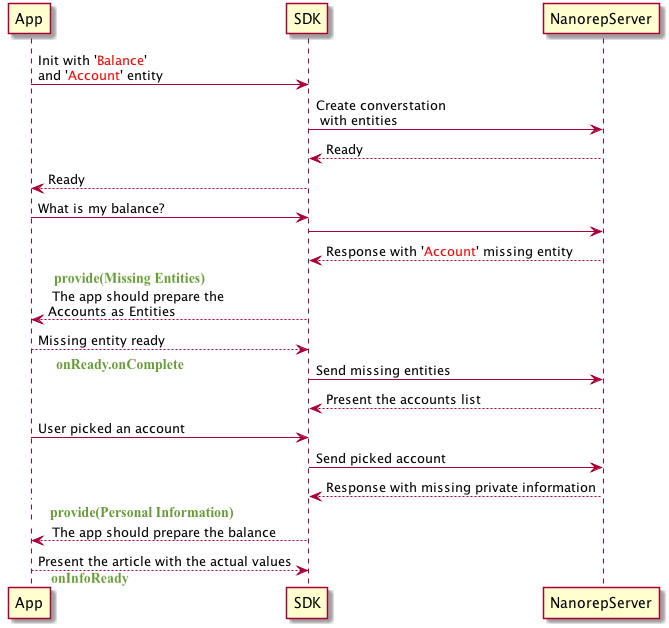

# Account entities and personal information

## **Definition**

The App can provide information on the specific user to server as per request (during run time).
User information can be provided in 2 ways:

1. `initialization entites` - Predefined data values that can be provided for the whole chat session and
    are not being changed dynamically.
    A valide initialization entity can be `UserId` for an instance.

2. `Missing entites` or `Personal information` - Dynamically changed data values that can be
   provided to a specific article in a specific placeholder.
   The article uses a Bold360AI provider implementation in order to provide the needed data (please contect out support for farther information about the Bold360AI provider).

   - Missing entites: If the client (an App uses the mobile) registerered to the missing entities which are needed by the provider, the provider asks the client for the data.
   The `EntitesProvider` would be called to provide the info.
   A valide missing entity can be `AccountName` for an instance.

   - Personal information - After the missing entitiy has been provided, the personal information about this missing entity can be also requested by the server.
   A valide personal info can be the `account balance` of the previosly supplied `AccountName` for an instance.

   

## **How to use**

## Initialization Entities

If the account is using Initialization Entities, create BotAccount as follows:

1. Create the initialization entities map

    ```kotlin
    val entities = mapOf("EntityKey1" to "EntityValue1", "EntityKey2" to "EntityValue2", ... )
    ```

2. Register your initialization entities as follows

    ```kotlin
    val account = BotAccount(...).apply {
                              initializationEntities = entities
                         }
    ```

- Note: The `initialization entities` can be also supplied at the `AccountInfoProvider`'s OnAccountReady method as follows:

    ```kotlin
    override fun provide(account: AccountInfo, callback: Completion<AccountInfo>) {
        ...
        (account as? BotAccount)?.initializationEntities = hashMapOf(Pair("USERID", "12345"))
        ...
    }
    ```

## Missing entities or Personal information

1. Create the missing entities array

    ```kotlin
    val missingEntities = arrayOf("EntityKey1", "EntityKey2"... )
    ```

2. Register your dynamic entities as follows:

     ```kotlin
    val account = BotAccount(...).apply {
                              entities = missingEntities
                         }
    ```

3. Implement the `EntitiesProvider` interface.
   At the `EntitiesProvider` there are two `provide` methods for `personal information` and for `missing entities`.

4. Pass the implementation of the `EntitiesProvider` to the `ChatController` at the ChatController creation

    ```kotlin
    ChatController.Builder(getContext()).entitiesProvider(the EntitiesProvider implemintation)...build(...)

 >Follow the next [link](missing_entities_example.md) for a specific example of `missing entities` and `personal information` usage
