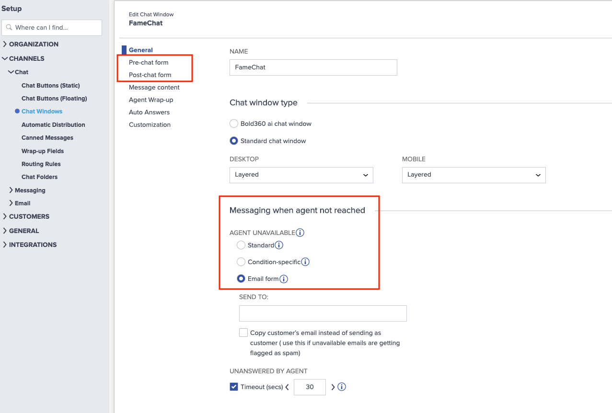

# Live chat forms
The SDK provides un-configurable implementation of the following forms:   
- PreChat - Enabling the user to provide some extra data that will be available to the agent once the chat will start. 
- PostChat - Left the user give some feedback about the ending chat.
- Unavailable (email) - In case the chat can't be performed at the moment, the user can provide his email, to be contacted later.

Once a form should be presented to the user, the Bold BE provides a list of fields that should be displayed on that form.   
The form fields are configured on the admin console, under the accounts chat window.   
Each field has properties which defines its look and behavior among them: field type, isRequired, and if available, its current value.




## How to customize
The SDK provides a way for the embedding App to use self customed form implementations, and display them when needed.

1. ### Create customed form
    Create a customed implementation of the chat forms.

    ```kotlin
    class FormDummy : Fragment() {

    private var formData: FormData? = null
    private var formListener: WeakReference<FormListener>? = null

    override fun onViewCreated(view: View, savedInstanceState: Bundle?) {
        // go over formData.fields list and construct the form views ...

        submit.setOnClickListener {

            // go over the form fields view and set the corresponding 
            // value to each field in formData.fields
            ...

            // pass results back to the SDK:
            formListener?.get()?.onComplete(formData?.chatForm)
        }
    }

    override fun onStop() {
    // in case the form was was canceled, user doesn't submit form
    // the onCancel should be activated on the formListener.  
        if (isRemoving && !isSubmitted) {
            listener?.get()?.onCancel(data?.formType)
        }

        super.onStop()
    }
    ```
  > - `FormListener.onComplete` should be called to submit form data to the SDK.
  > - `onCancel` should be called if the form submission was canceled.
        

2. ### Implement the `FormProvider` interface.
    
   In case an implementation of the FormProvider is available on the ChatController, it will be called for action, once a form should be displayed.    
  The method `FormProvider.presentForm(formData: FormData, callback: FormListener)` will be activated.
   * `FormData` - Provides the data needed to display the form; fields, branding map, etc...
   * `FormListener` - Results submission callback

   ```kotlin
    class FormProviderSample: FormProvider {
        
        override fun presentForm(formData: FormData, @NonNull callback: FormListener) {

            // Create the customed form implementation:
            val fragment = FormDummy.create(formData, callback)

            // add fragment to the activity to be displayed.
            supportFragmentManager
                .beginTransaction()
                .replace(R.id.chat_container, fragment, FORM_DUMMY_FRAGMENT_TAG)
                .addToBackStack(FORM_DUMMY_FRAGMENT_TAG)
                .commitAllowingStateLoss()
        }
    }
    ``` 
     
3. ### Pass FormProvider implementation on `ChatController` build. 
   
   ```kotlin
   ChatController.Builder(context)
           .formProvider(FormProviderSample)
           ...
           .build(account,...)
   ```

## How to mix form display
In case there's a need to mix custom and SDK provided form display, once the `presentForm` method is triggered, we enable to activate the SDK provided form instead of the custom one by calling <u>formListener.onComplete(**null**)</u>.
   
###### _[checkout sample implementation](https://github.com/bold360ai/bold360ai-mobile-samples)._

---

## Setting extra data
Setting extraData values on the BoldAccount, can be used for **prefilling the prechat form** values.   
the extraData provides some info to the agent about the user, and applies some configurations to the chat.

```kotlin
// setting extraData to the chat account:
// 1. 
boldAccount.addExtraData(SessionInfoKeys.Department to results.departmentId,
                         SessionInfoKeys.Language to "en-US", ...);

//2.
boldAccount.info.language = ...
```
> ##### _[available extraData fields](https://developer.bold360.com/help/EN/Bold360API/Bold360API/c_bc_sdk_ios_core_integration_chat_session.html)_


---

## Don't want the user to fill forms? 
### Skip Prechat Form

In order to skip the prechat, call `BoldAccount.skipPrechat()`, on the account that will be passed to the chat creation.   
When skipping prechat form, Extra data will provide the agent details about the user and can be used to set the language and department that should be configured for this chat.


